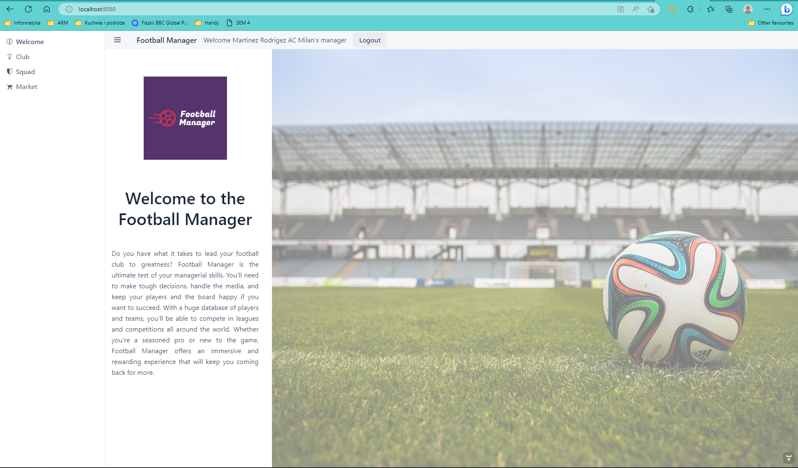
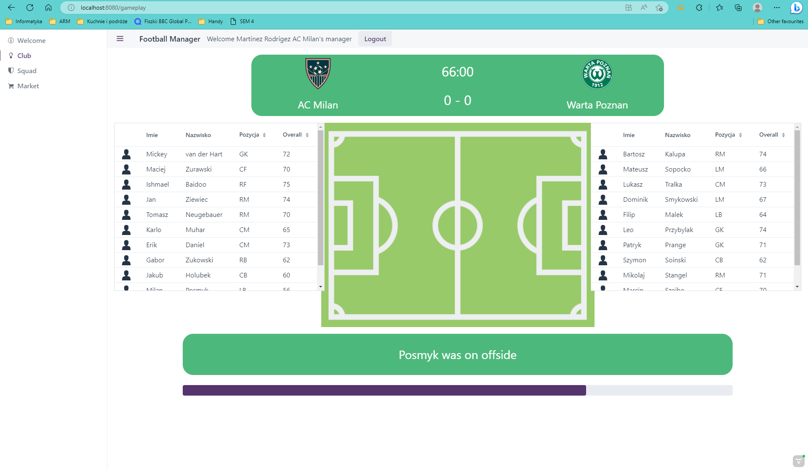
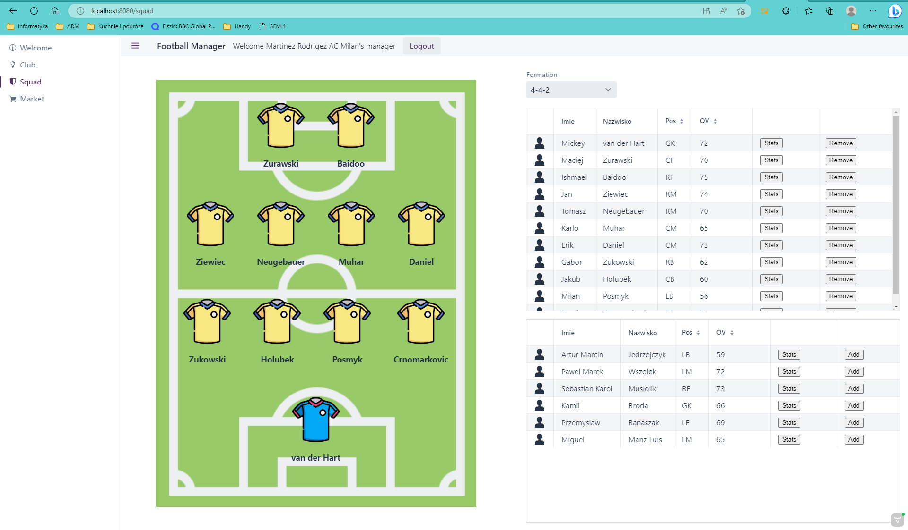
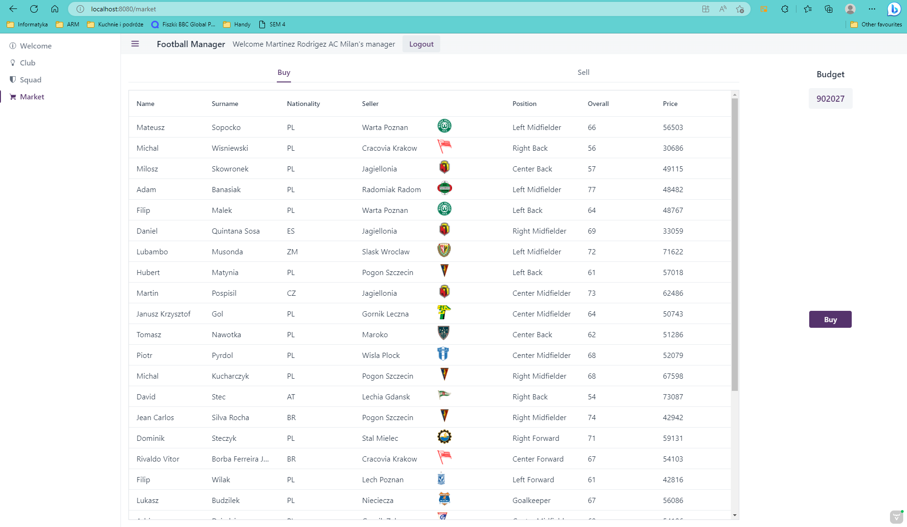

# Football Manager

## Osoby tworzące projekt

- Marcin Kowalczyk
- Stanisław Sikorski
- Daniel Tomala

## Technologie
**Maven** + **Spring Boot**

Środowisko: *IntelliJ* 

## Opis Projektu
Projekt "Football Managera" powstał w calu zaliczenia przedmiotu Programowanie Aplikacyjne.
## Konfiguracja
Trzeba zdefiniować własną bazę danych Oracle oraz wykonać w niej skrypty znajdujące się w folderze `sql` i zdefiniować nowe wartości połączenia z baza danych w pliku `src\main\java\com\example\controller\database\DatabaseConfig.java)`.

## Finalny wygląd projektu

### Widok powitalny

### Klub

### Gameplay

### Zawodnicy

### Market

